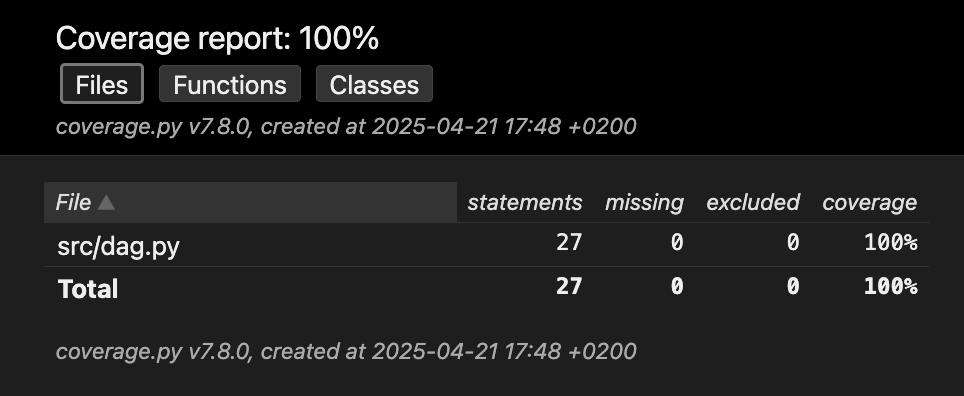

## Project Setup and Testing

This project uses **pytest** for testing and **pytest-coverage** to generate code coverage reports.

### 1. Install Dependencies

Ensure you have Python installed (3.11+ recommended). Then install the required packages:

```bash
pip install -r test_requirements.txt
```

### 2. Project Structure

```
.
├── src/
│   └── dag.py             # DAG class implementation and compute function
├── tests/
│   └── test_dag.py        # Test suites for DAG and compute()
└── README.md
└── test_requirements.txt
```

### 3. Running Tests with Coverage

Use the following command to run all tests in the `tests/` directory, measure coverage on the `src/` module, and generate both HTML and terminal reports:

```bash
pytest tests --cov=src --cov-report=html --cov-report=term
```

- `--cov=src` tells pytest-cov to measure coverage for the `src` package.
- `--cov-report=html` generates an HTML report in a directory named `htmlcov/`.
- `--cov-report=term` prints a coverage summary to the terminal.

You can then open `htmlcov/index.html` in your browser to explore detailed coverage results.

Below is an example screenshot of the html coverage report:

